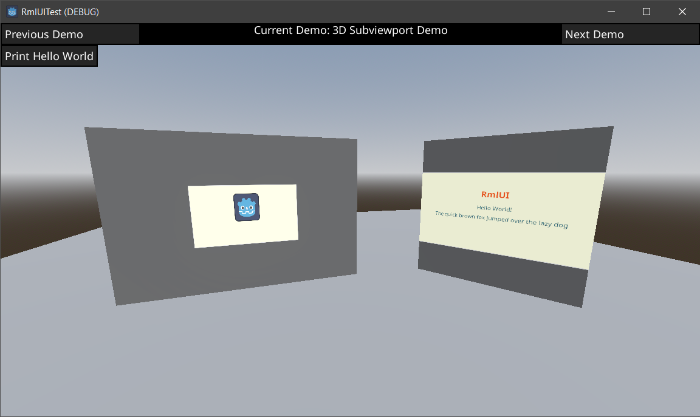
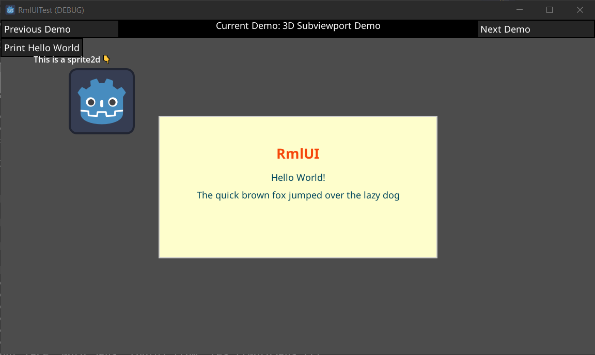

# Godot RmlUi
A GDExtension port of RmlUi to Godot 4.2+

**Current Progress:**
- Basic rendering on Canvas layers
- Integration with Godot Filesystem
- Texture support via Godot Texture Resource
- Full input via `_gui_input`
- Event binding in GDScript
- Inline GDScript in RML files
- Support for translating strings using Godot's Translation System

**ToDo:**
- GDScript Element Modification
- Integration with Godot Font System
- Editor Document rendering and modification

## Screenshots

## Build Instructions

### Prerequisites
- CMake 3.25+
- Godot 4.2+
- Git
- Ninja

### Windows

#### Visual Studio / CLion
- Clone the project via Git (or in your IDE)
- Open the directory as a CMake project
- Build `gdrml.dll`

It should now build the addon into the test project. Copy addon files to your project/open the test project.

### macOS
TODO

### Linux
TODO
